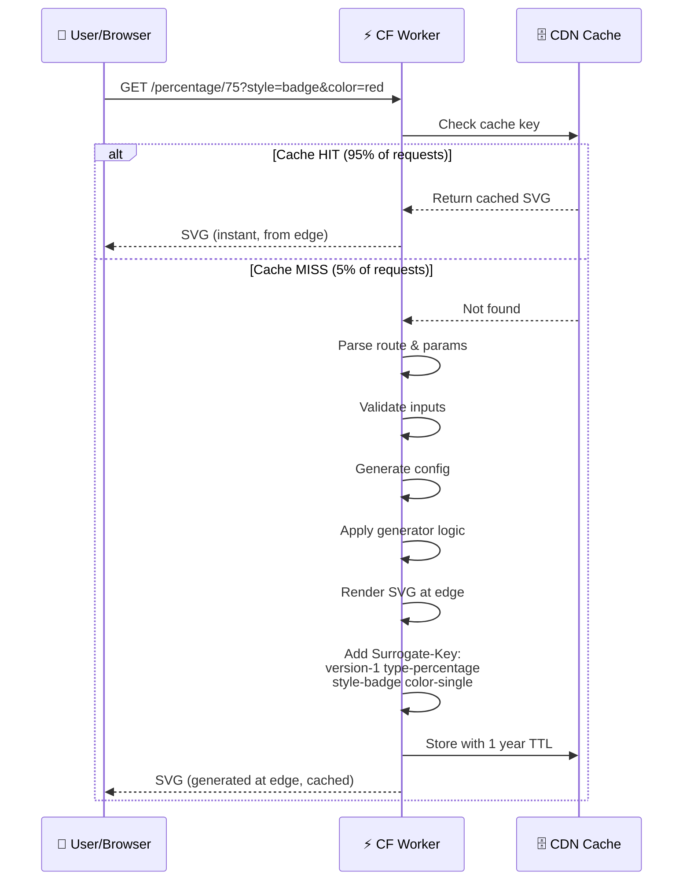
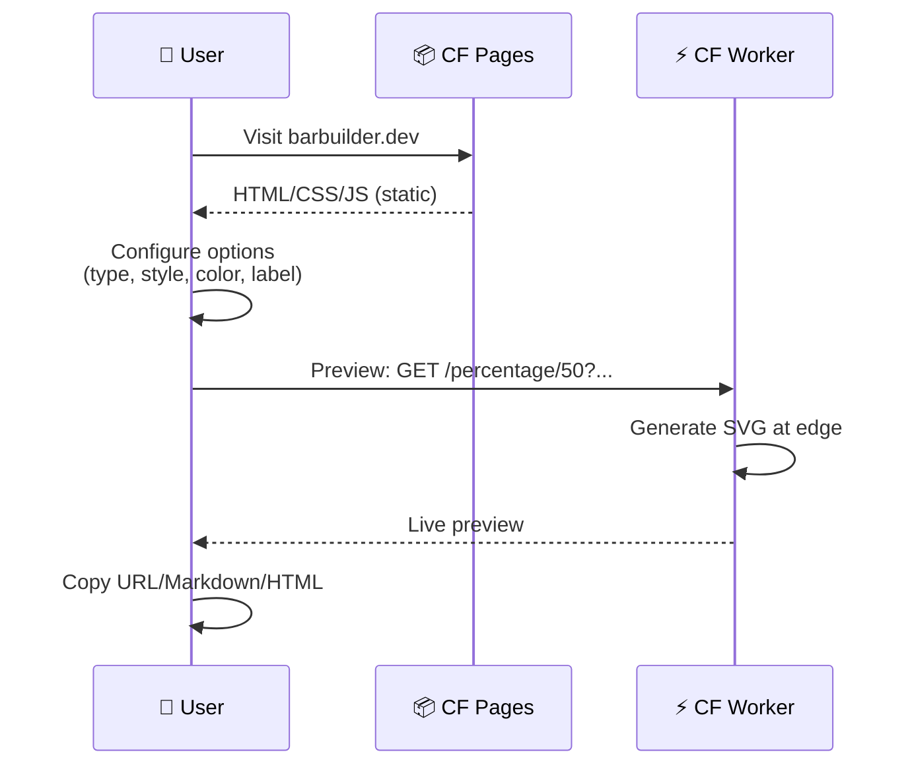
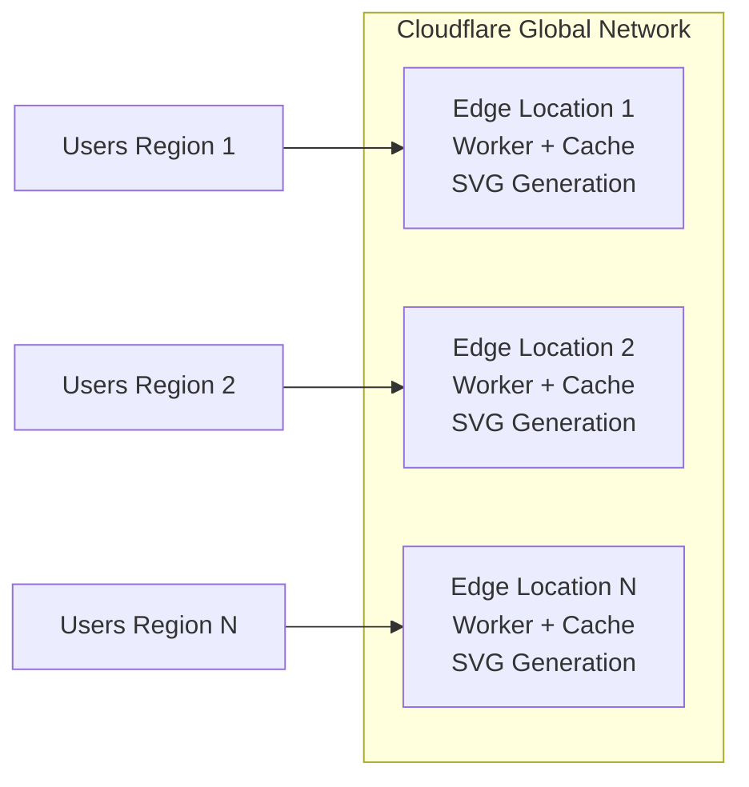

# BarBuilder.dev - System Architecture

## Overview

BarBuilder.dev is a stateless HTTP microservice for generating cacheable SVG progress bars via URL parameters. The system runs entirely on Cloudflare Workers at the edge, with no separate origin server required.

## ⚠️ Architecture Update (January 2026)

**Previous Architecture:** Three-tier (Worker → Origin API → Database)
**Current Architecture:** Workers-only (all processing at edge)

The Fastify API server has been deprecated. All SVG generation now happens directly in Cloudflare Workers.

## Architecture Diagram

```mermaid
graph TB
    subgraph "User Layer"
        USER[👤 User/Browser]
        README[📄 GitHub README]
        DOCS[📋 Documentation]
    end

    subgraph "Cloudflare Edge Network"
        WORKER[⚡ Cloudflare Worker<br/>SVG Generation at Edge]
        CACHE[(🗄️ CDN Cache<br/>~95% hit rate)]
        PAGES[📦 Cloudflare Pages<br/>Web UI Static Assets]

        subgraph "Worker Components"
            ROUTES[📍 Route Matching<br/>/percentage, /xofy, /icon]
            GENERATORS[⚙️ Generators<br/>Type Logic]
            STYLES[🎨 Style Renderers<br/>classic, pill, badge, etc.]
            COLORS[🌈 Color Module<br/>Named colors, gradients, contrast]
            VALIDATION[✅ Validation<br/>Input validation]
            SVGBUILDER[🔨 SVG Builder<br/>Renders final SVG]
        end
    end

    %% Request Flow: Progress Bar Generation
    USER -->|1. Request SVG<br/>GET /percentage/75?style=badge&color=red| WORKER
    README -->|Embed progress bar<br/>| WORKER
    DOCS -->|Display progress| WORKER

    WORKER -->|2. Check cache| CACHE
    CACHE -->|Cache HIT<br/>Return cached SVG| WORKER

    CACHE -->|Cache MISS<br/>Generate at edge| ROUTES
    ROUTES --> VALIDATION
    VALIDATION --> GENERATORS
    GENERATORS --> COLORS
    COLORS --> STYLES
    STYLES --> SVGBUILDER
    SVGBUILDER -->|3. Generate SVG| WORKER

    WORKER -->|4. Add Surrogate-Keys<br/>Store in cache| CACHE
    WORKER -->|5. Deliver SVG| USER

    %% Web UI Flow
    USER -->|Visit barbuilder.dev| PAGES
    PAGES -->|Serve static HTML/CSS/JS| USER
    USER -->|Configure & preview| WORKER

    %% Cache Management
    WORKER -.->|Surrogate-Key tags<br/>version-1, type-percentage,<br/>style-badge, color-single| CACHE

    style WORKER fill:#f96,stroke:#333,stroke-width:2px
    style CACHE fill:#9cf,stroke:#333,stroke-width:2px
    style PAGES fill:#fcf,stroke:#333,stroke-width:2px
```

## Request Flow

### 1. Progress Bar Request (Embedded Usage)



### 2. Web UI Request



## Component Details

### Shared Core Library

**Package:** `@barbuilder/core` (`/packages/core/`)

All SVG generation logic lives in a single shared package consumed by both the Cloudflare Worker and the Fastify test server. This eliminates code duplication and ensures parity between test and production environments.

**Components:**

1. **Generators** (`/src/generators/`)
   - Parse URL parameters and calculate progress values
   - `percentage` - Percentage-based progress
   - `xofy` - Fraction-based progress
   - `icon` - Icon-based progress (stars, hearts, etc.)

2. **Style Renderers** (`/src/styles/`)
   - `classic` - Traditional bar with label section
   - `pill` - Rounded ends, modern look
   - `minimal` - No labels, thin bar
   - `badge` - Badge style with auto-value
   - `segments` - Discrete blocks
   - `icon` - Icons-only (no bar)

3. **Colour Module** (`/src/core/colors.ts`)
   - Named CSS colours (red, blue, etc.)
   - Hex colour parsing (#ff0000)
   - Gradient generation
   - WCAG contrast calculation
   - Threshold colour steps

4. **SVG Builder** (`/src/core/svg-builder.ts`)
   - Assembles SVG elements
   - Handles text rendering
   - Manages gradients and defs
   - Generates final XML

5. **Validation** (`/src/core/validation.ts`)
   - Input validation for all parameter types

### Cloudflare Worker (Edge Layer)

**Location:** `/cloudflare-worker/src/index.ts`

**Responsibilities:**

- Route parsing and matching
- Query parameter parsing
- Delegates to `@barbuilder/core` for validation and SVG generation
- Cache key generation
- Surrogate-Key tagging for cache invalidation
- Cache header management
- Error handling (returns SVG error messages)

**Configuration:** `wrangler.toml`

- Production route: `barbuilder.dev/*`
- Staging route: `staging.barbuilder.dev/*`

**Tech Stack:**

- Cloudflare Workers runtime
- TypeScript
- V8 JavaScript engine (no Node.js)

### Fastify API Server (Integration Tests Only)

**Location:** `/api/src/`

**Status:** Not used in production. Provides a Fastify HTTP layer for integration testing the request/response cycle. Imports all core logic from `@barbuilder/core`.

### Web UI (User Interface)

**Location:** `/web/`

**Tech Stack:**

- Vite (build tool)
- Vanilla JavaScript
- HTML/CSS

**Features:**

- Interactive progress bar configurator
- Live preview
- Copy as URL/Markdown/HTML
- Preset templates
- Color palette picker
- Shape selector for icon type

## Data Flow

### Input → Output Pipeline

```mermaid
flowchart LR
    INPUT[URL Parameters] --> PARSE[Parse & Validate]
    PARSE --> GENERATOR[Apply Generator Logic]
    GENERATOR --> CONFIG[Build Config Object]
    CONFIG --> COLOR[Apply Colors/Theme]
    COLOR --> STYLE[Render with Style]
    STYLE --> SVG[Generate SVG XML]
    SVG --> CACHE[Add Cache Headers]
    CACHE --> OUTPUT[Return to Client]
```



### Configuration Object Structure

```typescript
interface ProgressConfig {
  type: "percentage" | "xofy" | "icon";
  value: number; // 0-100 normalized
  current?: number; // For xofy/icon
  total?: number; // For xofy/icon

  style: "classic" | "pill" | "minimal" | "badge" | "segments";
  width: number;
  height: number;

  colorMode: "single" | "gradient" | "threshold";
  color: string; // Hex (#RRGGBB)
  colorFrom?: string; // Gradient start
  colorTo?: string; // Gradient end
  backgroundColor: string;

  theme: "light" | "dark";
  label: string;

  segments?: number; // For segments style
  shape?: "8bit-heart" | "circle" | "heart" | "star";
}
```

## Caching Strategy

### Cache Headers (Successful Response)

```http
Cache-Control: public, max-age=31536000, immutable
Content-Type: image/svg+xml
Surrogate-Key: version-1 type-percentage style-badge color-single theme-light
Vary: Accept-Encoding
```

### Surrogate Key Structure

Used for targeted cache invalidation:

- `version-1` - Global version (purge all on breaking changes)
- `type-{percentage|xofy|icon}` - Purge by progress type
- `style-{classic|pill|...}` - Purge by style
- `color-{single|gradient|threshold}` - Purge by color mode
- `theme-{light|dark}` - Purge by theme

**Example Purge Scenarios:**

- Fix bug in pill style → Purge `style-pill`
- Update gradient algorithm → Purge `color-gradient`
- Breaking change → Purge `version-1`

### Cache Performance

- **Target Hit Rate:** 95%+
- **Origin Requests:** <5% of total traffic
- **Cache TTL:** 1 year (effectively permanent)
- **Cache Invalidation:** Surrogate-Key based

## Deployment Architecture

### Production Environment



**Key difference:** No origin server - all processing happens at the edge

### Deployment Targets

1. **Cloudflare Worker** → Cloudflare Edge Network (generates all SVGs)
2. **Web UI** → Cloudflare Pages (static hosting)

### Deployment Commands

**Deploy Worker:**

```bash
cd cloudflare-worker
pnpm deploy
```

**Deploy Web UI:**

```bash
cd web
pnpm build
# Deploy dist/ to Cloudflare Pages
```

## Operational Characteristics

### Performance

- **P50 Response Time:** <10ms (cache hit at edge)
- **P99 Response Time:** <50ms (cache miss, generated at edge)
- **Availability Target:** 99.99% (Cloudflare SLA)
- **Throughput:** Unlimited (scales with Cloudflare edge network)

### Cost Optimization

- **Zero infrastructure cost** → No servers to pay for
- **Free tier:** 100,000 requests/day included
- **After free tier:** ~$0.50 per million requests
- **No database costs** → Stateless design
- **Estimated Cost:** $0/month for most traffic levels

### Scalability

- **Horizontal:** Automatic via Cloudflare's 300+ edge locations
- **Vertical:** Not applicable (serverless)
- **Traffic Spikes:** Handled transparently by Cloudflare
- **No capacity planning needed**

## Security

- **No user accounts** → No authentication/authorization complexity
- **No persistent state** → No database security concerns
- **Rate limiting** → Cloudflare Worker enforces limits on cache misses
- **CORS** → Configured for web UI access
- **Input validation** → All parameters validated before processing

## Monitoring & Observability

### Key Metrics

1. **Cache Hit Rate** (target: 95%+)
2. **Origin Request Rate** (target: <5% of traffic)
3. **SVG Generation Latency** (target: <200ms P99)
4. **Error Rate** (target: <0.1%)
5. **CDN Bandwidth** (cost monitoring)

### Health Checks

- `/health` endpoint on origin API
- Returns: `{ status: 'ok', timestamp, service }`

## Future Enhancements

### Planned

- [ ] Rate limiting refinement
- [ ] Additional icon shapes
- [ ] Animation support (deferred)
- [ ] PNG export (deferred)
- [ ] Custom fonts (deferred)

### Architecture Evolution

- Add detailed observability (APM, error tracking)
- Implement automated cache warming for popular configurations
